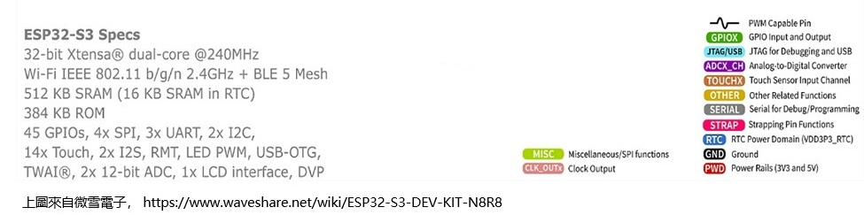

# PROJECT - WIFI AND AP LCD1602 TESTING

# ESP32_S3_WROOM1_BASE

ESP32_S3_WROOM1_BASE ：ESP32-S3-WROOM-1 /ESP32-S3-DEV-KIT-N16R8-M(16MB flash) 的基础功能：WIFI/AP/NFC/LCD

## 底板

### ESP32-S3-WROOM-1系列模组

ESP32-S3-DEV-KIT-N16R8-M【16MB flash】





## WIFI 連接資源

```
{
	"ssid":"TP-Link_C878",
	"password":"Lxxxxxxx6"
}
{
	"ssid":"WiFi001",
	"password":"abc12345"
}
{
	"ssid":"WIFI77A",
	"password":"Lxxxxxxx6"
}
```

## 功能描述

自動連接wi-fi,如果重連多次失敗則啟動AP熱點配置，提交 WIFI-SSID 和 WIFI-PASSWORD, 保存wifi_config.json 重启再連WIFI

LCD屏：提示WIFI STATUS and AP STATUS


## COMX選擇

如果您以开发为目的，选择合适的接口可以提高调试和开发效率。以下是一些建议：

1. **选择 JTAG 接口**：
   - 如果您需要进行深入的调试，可以选择 **USB JTAG/Serial debug unit @ COM8**。JTAG 接口适合更复杂的调试操作。
2. **选择串行接口**：
   - 若您只是想上传 MicroPython 代码并进行基本的串行通信，可以选择 **MicroPython (ESP32) @ COM7** 或 **MicroPython (ESP32) @ COM8**。这通常是开发过程中最常用的接口。
3. **同时使用**：
   - 在某些情况下，您可以同时使用串行和 JTAG 接口，进行代码上传和调试。确保在 Thonny 或其他 IDE 中正确配置和切换。

### 实践步骤

- **检查连接**：确保 ESP32 正确连接到计算机。
- **查看设备管理器**：确认 COM 端口号。
- **在 Thonny 中选择接口**：根据上面的建议选择相应的接口进行开发。

根据您的具体需求，选择合适的接口可以提高开发效率

**立創開發板**：同一ESP32-S3芯片的另一版本底板參考： https://wiki.lckfb.com/zh-hans/szpi-esp32s3/beginner/introduction.html

## AP熱點配置

```
WIFI NAME: DataGuardEsp PASSWORD: 12345678
```


## 屏幕LCD1602

```
ESP32-S2
资料路径：www.waveshare.net/wiki/LCD1602_I2C_Module
下載資料：
powershell
iwr "https://www.waveshare.net/w/upload/d/db/LCD1602_I2C_Module_code.zip" -OutFile "LCD1602_I2C_Module_code.zip"
linux
wget https://www.waveshare.net/w/upload/d/db/LCD1602_I2C_Module_code.zip
```

**ESP32-S3-WROOM-1 版本在 ： D:\EPS32\LCD1602\ESP32-S3-DRV**


## 硬件LCD1602連接ESP32-S3-WROOM-1

接線說明：一般来说，连接LCD1602通过I2C的方式如下：

- **VCC**: 连接到3.3V或5V（**3V3** Revised@2025-7-16）。

- **GND**: 连接到地线（**GND** Revised@2025-7-16）。

- **SDA**: 连接到微控制器的SDA引脚（ **GP4** Revised@2025-7-16）。

- **SCL**: 连接到微控制器的SCL引脚（**GP5**  Revised@2025-7-16）。

  
  
  ​									 

### LCD1602示例程序

```python
#示例程序下载
cd ~
wget https://www.waveshare.net/w/upload/d/db/LCD1602_I2C_Module_code.zip
unzip LCD1602_I2C_Module_code.zip
cd ~/LCD1602_I2C_Module_code/Raspberry
sudo chmod 777 *
cd python/
sudo python test.py #在LCD上显示两行字符的程序
sudo python time_test.py #自动获取本地时间并显示在LCD上的程序
```

- 代码解析

test.py

```python
lcd.setCursor(0, 0) #设置游标位置
# print the number of seconds since reset:
lcd.printout("Waveshare") #写入字符
lcd.setCursor(0, 1) #设置游标位置到第二行第零列
lcd.printout("Hello,World!")#写入字符
```


##  NFC拍卡  M4255

### UART 引脚 – 串行通信

ESP32-S3 支持多个 UART（通用异步收发器）接口，可与各种设备进行串行通信。ESP32 最多支持三个 UART 接口：UART0、UART1和UART2，具体取决于您使用的 ESP32 开发板型号。

与 I2C 和 SPI 一样，这些 UART 可以映射到任何 GPIO 引脚，尽管它们在大多数主板型号上都有默认引脚分配。

下表显示了 ESP32-S3 的默认 UART0、UART1 和 UART2 RX 和 TX 引脚：

**參考目前代碼： uart = UART(1, baudrate=9600, bits=8, parity=None, stop=1, rx=Pin(18), tx=Pin(17))**

| UART端口                  | 德克萨斯州 | 接收    | 评论                               |
| ------------------------- | ---------- | ------- | ---------------------------------- |
| UART0                     | GPIO 43    | GPIO 44 | 无法更改：意思应该是底板固定的GPIO |
| UART1**（Now Use This）** | GPIO 17    | GPIO 18 | 可以分配给其他GPIO                 |
| UART2                     | —          | —       | 分配您选择的任何引脚               |


## NFC拍卡業務

### 類 class UartM4255NfcModule:

### 函數 def uart_card_listen_and_return(self):

```
def uart_card_listen_and_return(self):
插入 雲端拍卡事件查詢 確權等等業務
插入 門禁開關業務
```

