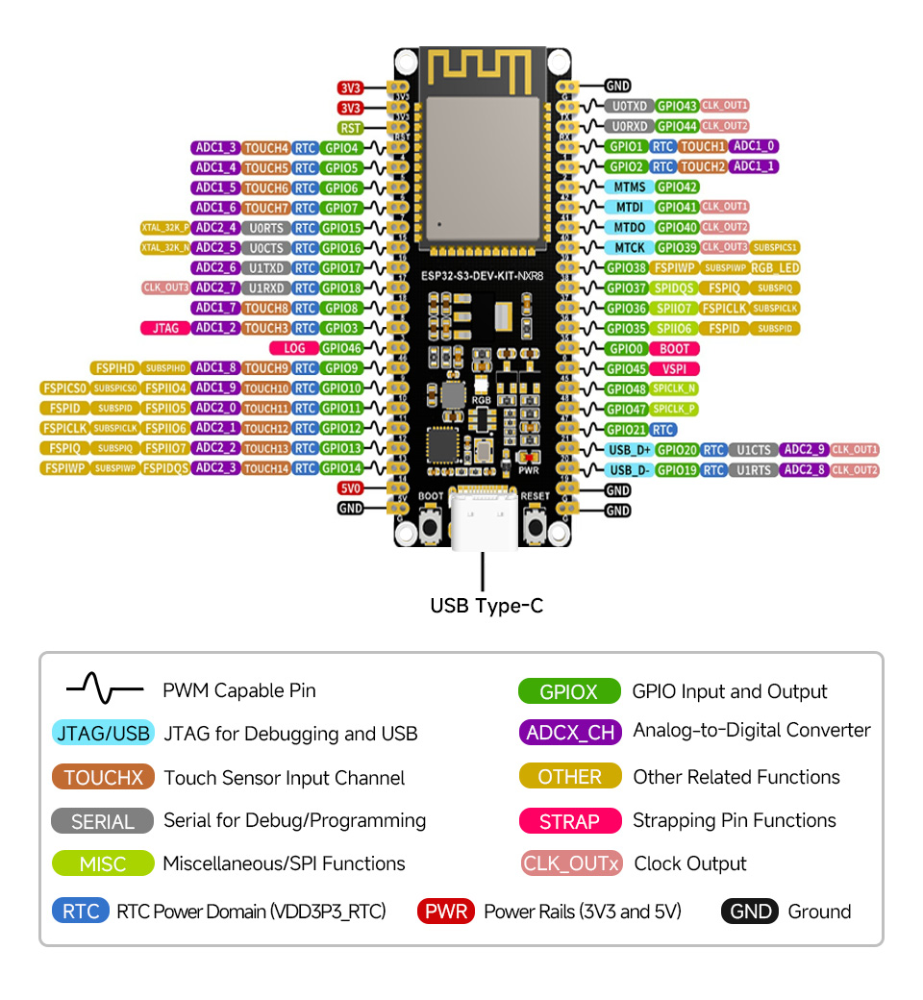
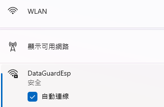
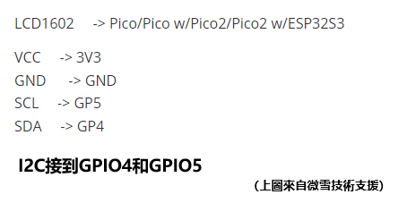

# PROJECT - WIFI AND AP LCD1602 TESTING

# ESP32_S3_WROOM1_BASE

ESP32_S3_WROOM1_BASE ：ESP32-S3-WROOM-1 /ESP32-S3-DEV-KIT-N16R8-M(16MB flash) 的基礎功能：WIFI/AP/NFC/LCD

## 底板

### ESP32-S3-WROOM-1系列模組

ESP32-S3-DEV-KIT-N16R8-M【16MB flash】




## WIFI 連接資源

```
{
 "ssid":"TP-Link_C878",
 "password":"Lxxxxxxx6"
}
{
 "ssid":"WiFi001",
 "password":"abc12345"
}
{
 "ssid":"WIFI77A",
 "password":"Lxxxxxxx6"
}
```

## 功能描述

自動連接wi-fi,如果重連多次失敗則啟動AP熱點配置，提交 WIFI-SSID 和 WIFI-PASSWORD, 保存wifi_config.json 重啟再連WIFI

LCD螢幕：提示WIFI STATUS and AP STATUS


## COMX選擇

如果您以開發為目的，選擇合適的介面可以提高調試和開發效率。以下是一些建議：

1. **選擇 JTAG 介面**：
 - 如果您需要進行深入的偵錯，可以選擇 **USB JTAG/Serial debug unit @ COM8**。 JTAG 介面適合更複雜的偵錯操作。
2. **選擇序列介面**：
 - 如果您只是想上傳 MicroPython 程式碼並進行基本的串行通信，可以選擇 **MicroPython (ESP32) @ COM7** 或 **MicroPython (ESP32) @ COM8**。這通常是開發過程中最常使用的介面。
3. **同時使用**：
 - 在某些情況下，您可以同時使用串行和 JTAG 接口，進行程式碼上傳和調試。確保在 Thonny 或其他 IDE 中正確配置和切換。

### 實踐步驟

- **檢查連接**：確保 ESP32 正確連接到電腦。
- **檢視裝置管理員**：確認 COM 連接埠號碼。
- **在 Thonny 中選擇介面**：根據上面的建議選擇相應的介面進行開發。

根據您的特定需求，選擇合適的介面可以提高開發效率

**立創開發板**：同一ESP32-S3晶片的另一個版本底板參考： https://wiki.lckfb.com/zh-hans/szpi-esp32s3/beginner/introduction.html

## AP熱點配置

```
WIFI NAME: DataGuardEsp PASSWORD: 12345678
代碼：
self.ap.ifconfig(('192.168.4.1', '255.255.255.0', '192.168.4.1', '192.168.4.1'))
```



如果沒有顯示AP熱點名稱，可以直接輸入熱點名稱WIFI NAME: DataGuardEsp PASSWORD: 12345678

然後開啟網頁設定 http://192.168.4.1

## 螢幕LCD1602

```
ESP32-S2
資料路徑：www.waveshare.net/wiki/LCD1602_I2C_Module
下載資料：
powershell
iwr "https://www.waveshare.net/w/upload/d/db/LCD1602_I2C_Module_code.zip" -OutFile "LCD1602_I2C_Module_code.zip"
linux
wget https://www.waveshare.net/w/upload/d/db/LCD1602_I2C_Module_code.zip
```

**ESP32-S3-WROOM-1 版本在 ： D:\EPS32\LCD1602\ESP32-S3-DRV**


## 硬體LCD1602連接ESP32-S3-WROOM-1

接線說明：一般來說，連接LCD1602透過I2C的方式如下：

- **VCC**: 連接到3.3V或5V（**3V3** Revised@2025-7-16）。

- **GND**: 連接到接地線（**GND** Revised@2025-7-16）。

- **SDA**: 連接到微控制器的SDA接腳（ **GP4** Revised@2025-7-16）。

- **SCL**: 連接到微控制器的SCL接腳（**GP5** Revised@2025-7-16）。 




### LCD1602範例程序

『`python

### 範例程式下載

```
cd ~
wget https://www.waveshare.net/w/upload/d/db/LCD1602_I2C_Module_code.zip
unzip LCD1602_I2C_Module_code.zip
cd ~/LCD1602_I2C_Module_code/Raspberry
sudo chmod 777 *
cd python/
sudo python test.py #在LCD上顯示兩行字元的程式
sudo python time_test.py #自動取得本機時間並顯示在LCD上的程序
```


```
- 程式碼解析

test.py

『`python
lcd.setCursor(0, 0) #設定遊標位置
# print the number of seconds since reset:
lcd.printout("Waveshare") #寫入字符
lcd.setCursor(0, 1) #設定遊標位置到第二行第零列
lcd.printout("Hello,World!")#寫入字符
```


## NFC拍卡 M4255

### UART 接腳 – 串列通信

ESP32-S3 支援多個 UART（通用非同步收發器）接口，可與各種設備進行串行通訊。 ESP32 支援最多三個 UART 介面：UART0、UART1和UART2，取決於您使用的 ESP32 開發板型號。

與 I2C 和 SPI 一樣，這些 UART 可以對應到任何 GPIO 引腳，儘管它們在大多數主機板型號上都有預設引腳分配。

下表顯示了 ESP32-S3 的預設 UART0、UART1 和 UART2 RX 和 TX 引腳：

**參考目前代碼： uart = UART(1, baudrate=9600, bits=8, parity=None, stop=1, rx=Pin(18), tx=Pin(17))**

| UART連接埠 | 德州 | 接收 | 評論 |
| ------------------------- | ---------- | ------- | ---------------------------------- |
| UART0 | GPIO 43 | GPIO 44 | 無法更改：意思應該是底板固定的GPIO |
| UART1**（Now Use This）** | GPIO 17 | GPIO 18 | 可以分配給其他GPIO |
| UART2 | — | — | 指派您選擇的任何引腳 |


## NFC拍卡業務

### 類 class UartM4255NfcModule:

### 函數 def uart_card_listen_and_return(self):

```
def uart_card_listen_and_return(self):
插入 雲拍卡事件查詢 確切關係等等業務
插入 門禁開關業務
```

DEMO [ACS DEVICE（Access Control System Device).MP4]