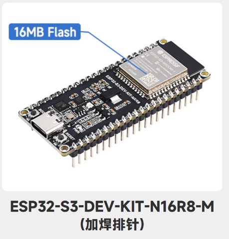

# PROJECT - WIFI AND AP LCD1602 TESTING

# ESP32_S3_WROOM1_BASE

ESP32_S3_WROOM1_BASE ：ESP32-S3-WROOM-1 / ESP32-S3-DEV-KIT-N16R8-M(16MB flash) 的基礎功能：WIFI/AP/NFC/LCD

## 底板

### ESP32-S3-WROOM-1系列模組

ESP32-S3-DEV-KIT-N16R8-M【16MB flash】




http://www.waveshare.net/wiki/ESP32-S3-DEV-KIT-N16R8-M 

## WIFI 連接資源

```
{
 "ssid":"TP-Link_C878",
 "password":"Lxxxxxxx6"
}
{
 "ssid":"WiFi001",
 "password":"abc12345"
}
{
 "ssid":"WIFI77A",
 "password":"Lxxxxxxx6"
}
```

## 功能描述

自動連接wi-fi,如果重連多次失敗則啟動AP熱點配置，提交 WIFI-SSID 和 WIFI-PASSWORD, 保存wifi_config.json 重啟再連WIFI

LCD螢幕：提示WIFI STATUS and AP STATUS


## COMX選擇

如果您以開發為目的，選擇合適的介面可以提高調試和開發效率。以下是一些建議：

1. **選擇 JTAG 介面**：
 - 如果您需要進行深入的偵錯，可以選擇 **USB JTAG/Serial debug unit @ COM8**。 JTAG 介面適合更複雜的偵錯操作。
2. **選擇序列介面**：
 - 如果您只是想上傳 MicroPython 程式碼並進行基本的串行通信，可以選擇 **MicroPython (ESP32) @ COM7** 或 **MicroPython (ESP32) @ COM8**。這通常是開發過程中最常使用的介面。
3. **同時使用**：
 - 在某些情況下，您可以同時使用串行和 JTAG 接口，進行程式碼上傳和調試。確保在 Thonny 或其他 IDE 中正確配置和切換。

### 實踐步驟

- **檢查連接**：確保 ESP32 正確連接到電腦。
- **檢視裝置管理員**：確認 COM 連接埠號碼。
- **在 Thonny 中選擇介面**：根據上面的建議選擇相應的介面進行開發。

根據您的特定需求，選擇合適的介面可以提高開發效率

**立創開發板**：同一ESP32-S3晶片的另一個版本底板參考： https://wiki.lckfb.com/zh-hans/szpi-esp32s3/beginner/introduction.html


## 默认配置

```
wifi_config.json 預設配置內容
{"ssid": "WiFi001", "password": "abc12345", "url_scheme": "http", "url_host": "192.168.0.9","url_host_port": 8080}
```

> [!TIP]
>
> 如果使用AP WIFI熱點配置比較麻煩，可以直接使用 複製 wifi_config.json文件到閃存，直接配置。


## AP熱點配置

```
WIFI NAME: DataGuardEsp PASSWORD: 12345678
代碼：
self.ap.ifconfig(('192.168.4.1', '255.255.255.0', '192.168.4.1', '192.168.4.1'))
```


如果沒有顯示AP熱點名稱，可以直接輸入熱點名稱WIFI NAME: DataGuardEsp PASSWORD: 12345678

然後開啟網頁設定 http://192.168.4.1

**你有300秒的時間連接AP和設置，300秒後重啟WIFI連接嘗試後，由於硬件資源不足，無法連接AP。**

頁面無法打開：1、注意是不是超時  2、WIFI處於重連

**請求正常**

Handling root request
Connection from ('192.168.4.2', 54730)
request_str GET / HTTP/1.1
Host: 192.168.4.1
Connection: keep-alive
Cache-Control: max-age=0
Upgrade-Insecure-Requests: 1
User-Agent: Mozilla/5.0 (Windows NT 10.0; Win64; x64) AppleWebKit/537.36 (KHTML, like Gecko) Chrome/138.0.0.0 Safari/537.36
Accept: text/html,application/xhtml+xml,application/xml;q=0.9,image/avif,image/webp,image/apng,*/*;q=0.8,application/signed-exchange;v=b3;q=0.7
Accept-Encoding: gzip, deflate
Accept-Language: zh-TW,zh-HK;q=0.9,zh;q=0.8,en-US;q=0.7,en;q=0.6 


## 時間設置

同步當前時間是GMT時間(格林威治時間)，也就是非北京香港當地時間。提取顯示和拍卡的時間是加上+8:00小時，不影響實際的當地時間的表示。


## 螢幕LCD1602

```
ESP32-S2
資料路徑：www.waveshare.net/wiki/LCD1602_I2C_Module
下載資料：
powershell
iwr "https://www.waveshare.net/w/upload/d/db/LCD1602_I2C_Module_code.zip" -OutFile "LCD1602_I2C_Module_code.zip"
linux
wget https://www.waveshare.net/w/upload/d/db/LCD1602_I2C_Module_code.zip
```

**ESP32-S3-WROOM-1 版本在 ： D:\EPS32\LCD1602\ESP32-S3-DRV**


## 硬體LCD1602連接ESP32-S3-WROOM-1

接線說明：一般來說，連接LCD1602透過I2C的方式如下：

- **VCC**: 連接到3.3V或5V（**3V3** Revised@2025-7-16）。

- **GND**: 連接到接地線（**GND** Revised@2025-7-16）。

- **SDA**: 連接到微控制器的SDA接腳（ **GP4** Revised@2025-7-16）。

- **SCL**: 連接到微控制器的SCL接腳（**GP5** Revised@2025-7-16）。 


### LCD1602範例程序

『`python

### 範例程式下載

```
cd ~
wget https://www.waveshare.net/w/upload/d/db/LCD1602_I2C_Module_code.zip
unzip LCD1602_I2C_Module_code.zip
cd ~/LCD1602_I2C_Module_code/Raspberry
sudo chmod 777 *
cd python/
sudo python test.py #在LCD上顯示兩行字元的程式
sudo python time_test.py #自動取得本機時間並顯示在LCD上的程序
```


```
- 程式碼解析

test.py

『`python
lcd.setCursor(0, 0) #設定遊標位置
# print the number of seconds since reset:
lcd.printout("Waveshare") #寫入字符
lcd.setCursor(0, 1) #設定遊標位置到第二行第零列
lcd.printout("Hello,World!")#寫入字符
```


## WIFI LED 信號燈

WIFI 功能指示燈 ESP32管腳GP02 連接RGB燈管腳B：DEBUG狀態 10秒，生產環境 30秒

WIFI信號燈
功能與用法說明：
ESP32-S2 LCD 使用引腳 PIN1#（GP02）
正常：每30秒閃一秒

## NFC拍卡 M4255

### UART 接腳 – 串列通信

ESP32-S3 支援多個 UART（通用非同步收發器）接口，可與各種設備進行串行通訊。 ESP32 支援最多三個 UART 介面：UART0、UART1和UART2，取決於您使用的 ESP32 開發板型號。

與 I2C 和 SPI 一樣，這些 UART 可以對應到任何 GPIO 引腳，儘管它們在大多數主機板型號上都有預設引腳分配。

下表顯示了 ESP32-S3 的預設 UART0、UART1 和 UART2 RX 和 TX 引腳：

**參考目前代碼： uart = UART(1, baudrate=9600, bits=8, parity=None, stop=1, rx=Pin(18), tx=Pin(17))**

| UART連接埠 | 德州 | 接收 | 評論 |
| ------------------------- | ---------- | ------- | ---------------------------------- |
| UART0 | GPIO 43 | GPIO 44 | 無法更改：意思應該是底板固定的GPIO |
| UART1**（Now Use This）** | GPIO 17 | GPIO 18 | 可以分配給其他GPIO |
| UART2 | — | — | 指派您選擇的任何引腳 |

### UART 4芯接線

**NFC拍卡 M4255 使用 XH2.54mm空中对接 公母插头端子4芯**


## NFC拍卡業務

硬件: 閔行科技 UART M4255 NFC

### 類 class UartM4255NfcModule:

### 函數 def uart_card_listen_and_return(self):

```
def uart_card_listen_and_return(self):
插入 雲拍卡事件查詢 確切關係等等業務
插入 門禁開關業務
```

DEMO [ACS DEVICE（Access Control System Device).MP4]

### 1、後台Response請求：

http://localhost:8080/zh-HK/Admin/DeviceManage/CardDeviceSimplifiedEntry


### 2、ESP32提交和響應


> [!NOTE]
>
> ESP32提交到響應以及提示燈等等，整個流程約需要3-5秒。具體涉及異步線程等等，如果連續多個間隔不足一秒，測試是通過的。大體排隊打卡，如果人數過於密集，可以增加多個單片機進行拍卡處理。具體場景需要進一步的負載測試。


## 拍卡指示燈

拍卡指示燈 G 管腳连 GPIO38         RGB_LED :  G<—>GPIO038

tapping_card_led_pin = 38 

##  WIFI信號燈

WIFI信號燈 RGB_LED GPIO02 winfi_led_pin = 2 


## 拍卡後台回傳

http://localhost:8080/zh-HK/Admin/AttendanceLog/List

<video src="./README_IMGs/NXP%20RC522_CONN_ESP32-S3-WROOM-1/The%20effect%20of%20tapping%20the%20card%E6%8B%8D%E5%8D%A1%E5%9B%9E%E5%82%B3%E7%9A%84%E6%95%88%E6%9E%9C.mp4"></video>


## 接線與壓線

### 1. XH2.54端子壓線

https://www.bilibili.com/video/BV1fGRmYrEZJ/?spm_id_from=333.337.search-card.all.click&vd_source=a07361f638d3efaf8f076955f5fcb1c6


### 2. 各種端子名稱


### 3. ESP32-S3 GPIO 擴展板


## 雲端Attendance Post API

拍卡事件，獲取NFC Card Number 以及當前時間 POST到雲端平台，

第一步、POST雲端之前，先登記設備和NFC CARDNUMBER
驗證設備是否登記： http://192.168.0.9:8080/zh-HK/Device/GetMainComBySerialNo/94a990029460

第二步、POST API 內容：
api :  en-US/Admin/DeviceManage/CardDeviceSimplifiedEntry
強制 {Language} = en-US

```
Body Json PostData
{
  "DeviceSerialNo": "94a990029460", 

  "OccurDateTime": 1628783438292,

  "NfcCardNumber": "3991852973"
}
```

注意：目前使用的硬件是 昱闵科技 UART接口M4255   uart_m4255_module.py::func：：uart_card_listen_and_return

注意：http error: [Errno 104] ECONNRESET ：請求連接出錯，或者連接到localhost的低級錯誤。

> [!IMPORTANT]
>
> **ESP32-S3提供的時間是本地時間，**而非 GMT格式時間，例如 香港本地時間是 22:30 ，不能寫成 02:30 GMT+08:00
>
> NTP同步成功，已转换为UTC+8时间: (2025, 7, 31, 3, 2, 54, 8, 90) # 格式：(年, 月, 日, 星期, 时, 分, 秒, 微秒)

<video src="./README_IMGs/拍卡到雲端驗證2.mp4"></video>

> [!TIP]
>
> 屏幕中，[ ***** ] 表示WIFI網絡信號是否正常連接。

<video src="./README_IMGs/%E6%8B%8D%E5%8D%A1%E5%88%B0%E9%9B%B2%E7%AB%AF%E9%A9%97%E8%AD%892.mp4"></video>

## PCB文檔與畫圖

虛擬電路畫圖 D:\EPS32\APP_ESP32_S3_WROOM_1\OTHER\ESP32-S3-DEV-KIT-N8R8-電路圖.PNG


## 電子元件採購列表

- [x] 1. **ESP32-S3-DEV-KIT-N16R8-M[16MB flash] 加焊排針** 

- [x] 2. **ESP32-S3扩展板模块**

- [x] 3. **Modbus RTU 单路继电器模块 TTL UART**

- [x] 4. **微雪 LCD1602 I2C接口 蓝底白字 带背光 LCD 液晶顯示屏**

- [x] 5. **閔行科技 NFC讀寫 M4255-HA/UART TTL接口/3.3V**

  6. 電導線 11條 長度 15-20cm

     


 